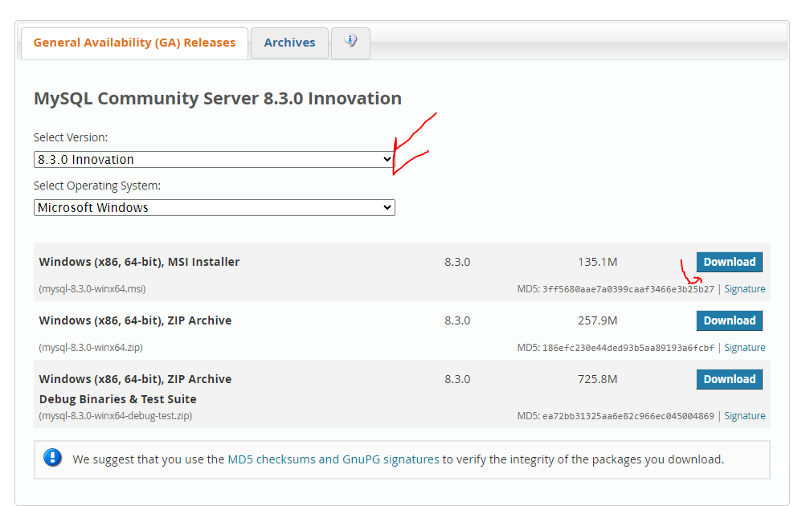
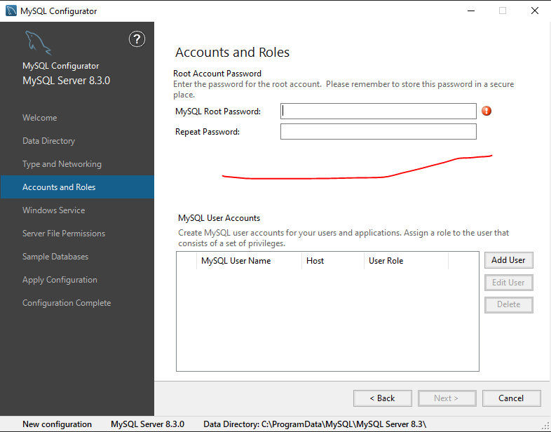
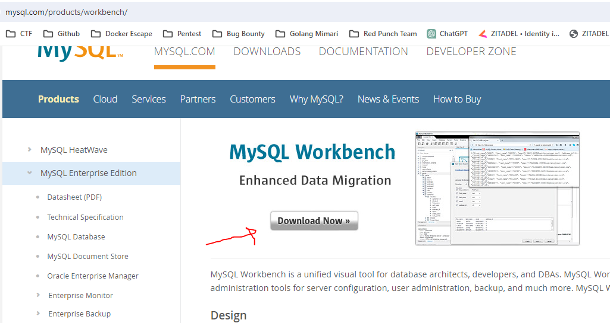
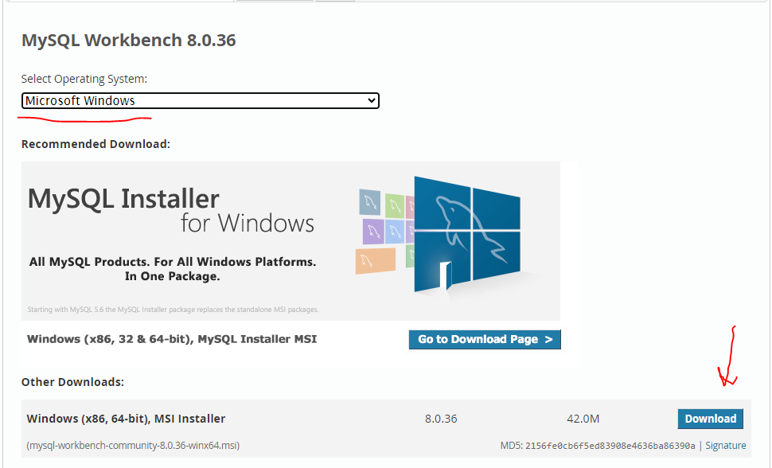
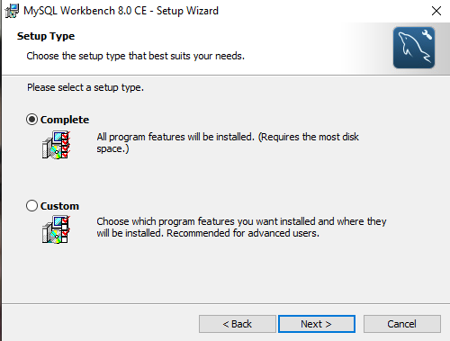
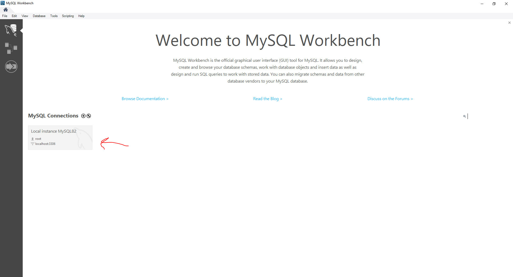
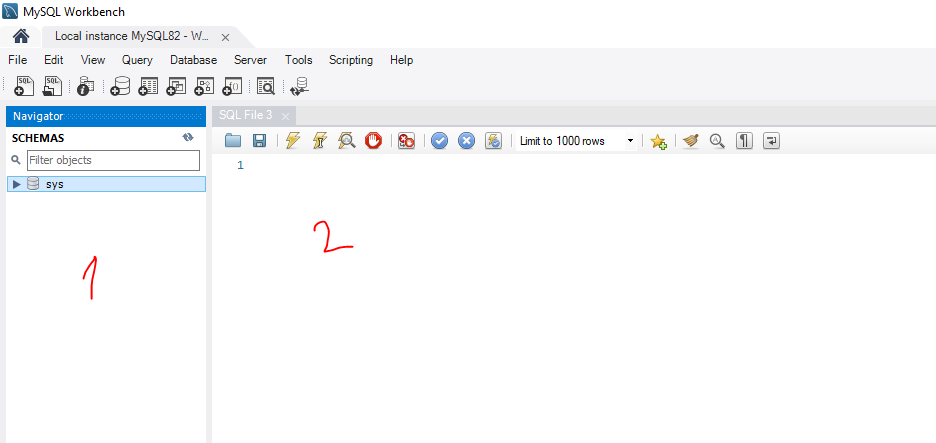

# 1. SQL

Bu yazımda temel **SQL** anlatacağım. Tablo oluşturma, veri ekleme, veri çekme, veri güncelleme, veri silme gibi konulardan bahsedeceğim

## 1.1. Veritabanı Kurulumu

Kuruluma geçmeden önce bu kurduğumuz **veritabanı** nedir? Ondan bahsedelim Veritabanı, yapılandırılmış verilerin depolandığı ve yönetildiği bir sistemdir. Bilgiyi organize etmek, erişmek ve güncellemek için kullanılır. Veritabanları genellikle ilişkisel **tablolar** şeklinde düzenlenir ve **SQL** gibi sorgu dilleriyle etkileşime girilir.

SQL nedir ve ne işe yarar'a geçmeden önce, uygulamalı bir şekilde öğrenme adımlarımızı takip etmek için bir veritabanı oluşturalım. Bu eğitimde **MYSQL Workbench** kullanacağız. Elbette, *PostgreSQL*, *SQL Server* gibi başka veritabanı sistemleri de mevcut, ancak başlangıç için **MYSQL'i** tercih edeceğiz. Şimdi kuruluma geçelim.

### 1.1.1. MYSQL Workbench

İlk olarak [MYSQL Server](https://dev.mysql.com/downloads/mysql/) indirin, ardından
[MYSQL Workbench](https://www.mysql.com/products/workbench/) sitesine girin ve aşağıdaki adımları uygulayarak indirin.

İlk olarak **MYSQL Server** indirin. Bu olmadan **MYSQL Workbench** kullanılamaz. Çünkü bağlanılacak server ortada yok. Kurulumu basit yukarıdaki siteden indirin.Sadece **"Next"** düğmesine tıklayarak ilerleyin. Son adımda, size aşağıdaki gibi bir soru sorulacaktır. Tavsiyem, indirmeyi tamamlamak için **"COMPLETE"** seçeneğini işaretlemenizdir.

<figure>
    
    <figcaption>MYSQL Workbench kurulum adımları</figcaption>
</figure>

Bunları yaptıktan sonra **MYSQL Configurator** penceresi gelecektir. Burada şimdilik bilmeniz gereken tek şey alttaki kısımda giriş yaparken kullanacağınız şifreyi belirtiniz.

<figure><figcaption></figcaption></figure>

Şimdi **MYSQL Workbench** kurulumuna bakalım.

<figure><figcaption></figcaption></figure>

Alt tarafta ise kendi işletim sisteminize göre seçin ve indirmeye başlayın.

<figure><figcaption></figcaption></figure>

İndirme işlemi tamamlandıktan sonra yapılacak işlemler oldukça basittir. Sadece **"Next"** düğmesine tıklayarak ilerleyin. Son adımda, size aşağıdaki gibi bir soru sorulacaktır. Tavsiyem, indirmeyi tamamlamak için **"COMPLETE"** seçeneğini işaretlemenizdir. Böylelikle her şeyi ile birlikte bilgisayarınıza inicektir.

<figure><figcaption></figcaption></figure>

### 1.1.2. Temel Kullanım

İndirip açıktan sonra alttaki gibi görüntü göreceksiniz. Eğer **MYSQL Server** kurulumunuzda bir sıkıntı var ise bağlanmayacaktır.

<figure><figcaption></figcaption></figure>

Şifreniz ile giriş yaptıktan sonra alttaki gibi bir pencere sizi karşılayacaktır.

<figure><figcaption></figcaption></figure>

Burada 1 ile yazılan kısım Database'lerin olduğu yer. 2 ile yazılan kısım ise **SQL** sorgularınızı yazdığınız kısım. 1 Yazan kısıma sağ tıklayıp **Create Schema** ya tıklayıp yeni **database** oluşturunuz.

<figure><figcaption></figcaption></figure>

Oluşturduğunuz database'i seçmek için **USE** yazıp sonra adını yazıyoruz. Artık veritabanı hangi database üzerinden işlem yapacağınızı biliyor. Ardından örnek olarak bir tablo oluşturma sorgusu bunun içine yazılabilir. Alt tarafta örneği bulunmaktadır.

Temel olarak kullanım bu kadar. Şimdi SQL sorgularına geçelim.

<figure><figcaption></figcaption></figure>

## 1.2. Nedir?

SQL (Structured Query Language), veritabanlarında veri depolamak, güncellemek ve sorgulamak için kullanılan bir programlama dilidir.

## 1.3 Neden Kullanılır?

Bu kısımda örnekler vererek açıklama yapacağım.

+ Bir internet sitesine girdiğinizde, üye olduğunuzda, giriş yaptığınızda veya bir sosyal medya sitesine girip bir gönderiyi beğendiğinizde, yaptığınız işlemlerin bir veritabanında saklanmasını genel olarak SQL ile gerçekleştiriyoruz.

+ Yaşadığımız bu yüzyılda, verilerin önemi giderek artmaktadır. Bu nedenle verinin doğru bir şekilde saklanması, doğru analiz edilmesi ve doğru bir şekilde kullanılması, yaptığınız projeler üzerinde büyük fayda sağlar.

Kısaca, hayatımızın her anında gittiğimiz yerler, telefondan girdiğimiz siteler, tıkladığımız linkler ve hatta bir videoyu kaç saniye izlediğimiz bile veritabanlarına SQL yardımıyla kaydediliyor. Peki, bu nasıl yapılır? Hadi bakalım.

# 2. SQL'de Sorgu Yapısı

Bu kısımda sorgulara girmeden önce ileride göreceğimiz temel işlemler hakında basit bilgi verip yapılarından bahstedeceğim.

SQL ile yapabileceğiniz temel işlemler aşağıdaki gibidir.
+ **SELECT**: Veritabanından veri çekmeyi sağlar.

```sql
SELECT sutun-1,sutun-2,...,sutun-n FROM tablo_adi;
```

Koşul ile birilikte kullanım.
```sql
SELECT sutun-1,sutun-2,...,sutun-n FROM tablo_adi WHERE kosul;
```

+ **INSERT**: Veritabanına veri eklemeyi sağlar.

```sql
INSERT tablo_adi (sutun-1,sutun-2,...,sutun-n) VALUES (deger-1,deger-2,...,deger-n);
```

+ **UPDATE**: Veritabanında hazır olan veriyi güncellemeyi sağlar.

```sql
UPDATE tablo_adi SET sutun-1 = deger-1, sutun-2 = deger-2, ... sutun-n = deger-n WHERE kosul;
```
+ **DELETE**: Veritabanında hazır olan veriyi silmeyi sağlar.

```sql
DELETE FROM tablo_adi WHERE kosul;
```

Yukarıdaki sorgu yapılarında farkındaysanız **WHERE** kullanılıyor. Bunun ile istediğimiz belirli bir veri üzerinde seçme,güncelleme ve silme işlemi yapılabilir. Daha detaylı açıklamayı alt tarafta bulabilirsiniz.

# 3. SQL'de Temel İşlemler

## 3.1. Tablo Oluşturma (CREATE TABLE)

Tablo oluşturmadan önce, tablonun ne olduğunu ve neden tablo oluşturduğumuzu anlamak önemlidir. Günümüzde, veritabanları verileri tablo dediğimiz yapılar içinde saklar. İşte aşağıda, bir veritabanında tutulan bir tabloyu temsil eden örnek bir yapı:


| id     | name   | surname   |
|--------------|------------|------------|
| 1 | Çetin Boran | Mesüm |
| 2 | Murat Kaan | Mesüm |

Tabloların içinde saklanacak veri türlerini biz belirleriz ve yalnızca belirlediğimiz türde veri kabul ederiz.
Tablo oluştururken ilk olarak **CREATE TABLE** ifadesiyle başlarız ve ardından tablonun adını belirtiriz. Yukarıda belirttiğimiz sütun adını ve alabileceği veri türünü de isimden sonra yazılan () içinde yazarız. İşte bir örnek yapısı:

```sql
    CREATE TABLE tablo_ismi(
        sütun1 veritürü özellikler,
        sütun2 veritürü özellikler,
        sütun3 veritürü özellikler,
    )
```

Bu kısımda **sütun** başlıkları belirtilir. **Veri türü** ise bu sütunda hangi tür veri saklanacağını belirtir. Veritabanına göre bu veri türleri değişiklik gösterebilir. İşte alt kısımda örnek veri türü:

- **VARCHAR (Karakter Dizisi)**: Değişken uzunluktaki metinleri saklamak için kullanılır. Belirli bir maksimum uzunluğa sahip olabilir.
- **CHAR (Karakter)**: Sabit uzunluktaki metinleri saklamak için kullanılır. Belirli bir uzunluğa sahip bir karakter dizisi olarak tanımlanır. Karakter dizisi bu uzunlukta değilse, boşluklarla doldurulur.
- **INT (Tamsayı)**: Tam sayı değerlerini saklamak için kullanılır. İnteger olarak adlandırılır.
- **FLOAT (Kayan Noktalı Sayı)**: Ondalık sayıları saklamak için kullanılır. Kesirli sayıları temsil eder.
- **DATE (Tarih)**: Yıl, ay ve gün bilgisini saklamak için kullanılır. Yıl, ay ve gün değerlerini içerir.
- **DATETIME (Tarih ve Saat)**: Yıl, ay, gün, saat, dakika ve saniye bilgisini saklamak için kullanılır. Tarih ve saat bilgisini içerir.


**Özellikler** kısmı, o sütunların durumlarını tutar. Örneğin, bir sütuna veri girerken boş olup olmaması, varsayılan değeri ne olacağı, birincil anahtar mı yoksa yabancı anahtar mı olduğu gibi durumları belirtir. Veritabanlarına göre değişiklik gösterebilirler.

- **NOT NULL**: Bu özellik, bir sütunun boş olamayacağını belirtir. Yani, bu sütuna her zaman bir değer verilmelidir.
- **DEFAULT**: Bu özellik, bir sütuna varsayılan bir değer atar. Eğer sütuna değer verilmezse, bu varsayılan değer kullanılır.
- **PRIMARY KEY**: Bu özellik, bir sütunu birincil anahtar olarak belirtir. Her bir satırın benzersiz bir şekilde tanımlanması için kullanılır. Genellikle **PRIMARY KEY** otomatik atanır. Veri oluşturulurken atanmaz.

Şimdi aşağıda örnek olarak bir tablo oluşturalım. Bu senaryoda bir sitedeki kullanıcı bilgilerini tutan bir tablo oluşturalım

```sql
CREATE TABLE users (
    id INT PRIMARY KEY,
    username VARCHAR(50) NOT NULL,
    email VARCHAR(100) UNIQUE,
    password VARCHAR(50) NOT NULL,
    birthDate DATE,
    registrationDate TIMESTAMP DEFAULT CURRENT_TIMESTAMP
);

```
## 3.2. Seçme (SELECT)

**SELECT**: Bu sorgu ile tabloya veri çekme işlemini yapacağız.

```sql
SELECT sütun-1,sütün-2,...,sütün-n FROM tablo_ismi;
```

Bu sorguda, SELECT anahtar kelimesiyle belirli sütunları seçtiğimizi belirtiyoruz. Ardından, virgülle ayrılmış bir şekilde istediğimiz sütun isimlerini yazıyoruz. Burada `*` koyarsak sütünları belirlediğimiz kısımda bütün sütünları alacaktır. Son olarak, veriyi çekeceğimiz tablonun adını belirtiyoruz. ";" sembolü sorgunun sonlandığını belirtir.

Belirli bir sütunun belirli bir değere sahip olanları döndürmek istiyorsak, SQL'de `WHERE` ifadesini kullanırız. Öncelikle normal bir sorguyu yazıp, ardından `WHERE` ifadesini kullanarak belirli bir sütunun belirli bir değere eşit olduğu koşulunu ekleriz. Bu koşulu belirtmek için de sütun adını ve istenen değeri kullanırız. Örneğin, `WHERE sütun_adı = 'değer'` şeklinde bir ifade kullanarak belirli bir sütunun belirli bir değere eşit olan verileri getirebiliriz.

Aşağıdaki örnekte, **users** tablosundan *id*, *username* ve *email* sütunlarını çekiyorum. Ancak sadece username sütunu **"2023an"** olan verileri alıyorum.
```sql
SELECT id, username, email FROM users WHERE username = '2023an';
```

Özetle **WHERE** kullanarak koşullu sorgular oluşturabiliyoruz.

Eğer verilerin belli sıralama ile gelmesini istiyorsak `ORDER BY` kullanacağız. Bununla ilgili sadece örnek vermek yeterli olucaktır.

Aşağıdaki örnekte, **users** tablosundan `*` ile bütün sütunları çekiyorum. Username sütununa göre alfabetik sıralama yapıyorum. 
```sql
SELECT * password FROM users ORDER BY username;
```

Son olarak gruplama görelim. Bir kullanıcılar tablosu düşünün. İçerisinde isim, soyisim ve il olarak 3 tane sütun olsun. Benim istediğim hangi ilden kaç tane kullanıcı var onu bulmak istiyorum. Bunun için bilmemiz gereken iki tane yapı var.

**COUNT(*)** kullanarak bir tabloda kaç veri olduğunu öğrenebiliriz.

Aşağıda örnek olarak **users** tablosunda kaç kayıt var onu döndüren soruguyu görebilirsiniz.
```sql
SELECT COUNT(*) FROM users;
```

**GROUP BY** ile gruplamayı öğreneceğiz

Aşağıdaki örnekte, **users** tablosundan kullanıcı il'ini ve sayısını çekiyoruz ve bunları il'e göre grupluyoruz. Ek bilgi olarak burada **AS** anahtar kelimesi ile sütun ismini değiştirebiliyoruz.
```sql
SELECT il, COUNT(*) AS Toplam FROM users GROUP BY il;
```

Aşağıda bu sorgunun örnek bir çıktısını görebilirsiniz.

| username | il        | Toplam |
|----------|-----------|----------|
| user1    | Istanbul  | 3        |
| user2    | Ankara    | 2        |
| user3    | Istanbul  | 1        |
| user4    | Izmir     | 2        |

## 3.3. Ekleme (INSERT)

**INSERT**: Bu sorgu ile tabloya veri ekleme işlemini yaparız.

Aşağıdaki örnekte, tablo_adı yazdıktan sonra ilk parantez içinde hangi sütunlara veri yükleyeceğimizi belirliyoruz. Sonrasında VALUES kısmında ise bu sütunlarla ilişkilendirilmiş değerleri belirtiyoruz. Özetle, sütun1 = değer1, sütun2 = değer2 gibi bir eşleştirme yapıyoruz.
```sql
INSERT INTO tablo_adı (sütun1, sütun2, sütun3, ...) VALUES (değer1, değer2, değer3, ...);
```

Aşağıdaki örnekte, users tablosuna username alanı için **"2023an"** ve password alanı için **"cokgizlisifre123"** değerlerini içeren bir veri ekledim.
```sql
INSERT INTO users (username, password) VALUES ('2023an', 'cokgizlisifre123');
```

## 3.4. Güncelleme (UPDATE)

**UPDATE**:Bu sorgu ile tabloda hazır olan veriyi güncelleriz.

Aşağıdaki örnekte, **UPDATE** işlemiyle birlikte **SET** anahtar kelimesini kullanarak hangi sütunların güncelleneceğini belirtiriz ve her bir sütunun yeni değerini atarız. Bu sorgu genellikle **WHERE** ile birlikte kullanılır, bu sayede belirli koşullara uyan satırlar güncellenir.

```sql
UPDATE tablo_adi SET sutun-1 = deger-1, sutun-2 = deger-2, ... sutun-n = deger-n WHERE kosul;
```

Aşağıdaki örnekte **users** tablosunda **id** değeri 2 olan kullanıcının username'ini *Kaan* olarak değiştiriyorum.
```sql
UPDATE users SET username='Kaan' WHERE id = 2;
```

## 3.5. Silme (DELETE)

**DELETE**: Bu sorgu ile tabloda olan bir veriyi silebiliyoruz.

Aşağıdaki örnekte, basit olarak bir silme işlemi yapılmıştır. Tablo içerisinden belli kayıtları sileceğimiz için **WHERE** ile kullanılır.
```sql
DELETE FROM tablo_adi WHERE kosul;
```

Bu örnekte ise **users** tablosu içerisinde **id** değeri 2 olan kullanıcıyı tablodan sildik.
```sql
DELETE FROM users WHERE id = 2;
```

# 4. Kaynakça

<details>
<summary>SQL İçin Kaynakça</summary>

- [W3Schools](https://www.w3schools.com/sql/)
- [Free Code Camp](https://www.youtube.com/watch?v=HXV3zeQKqGY&ab_channel=freeCodeCamp.org)

</details>
